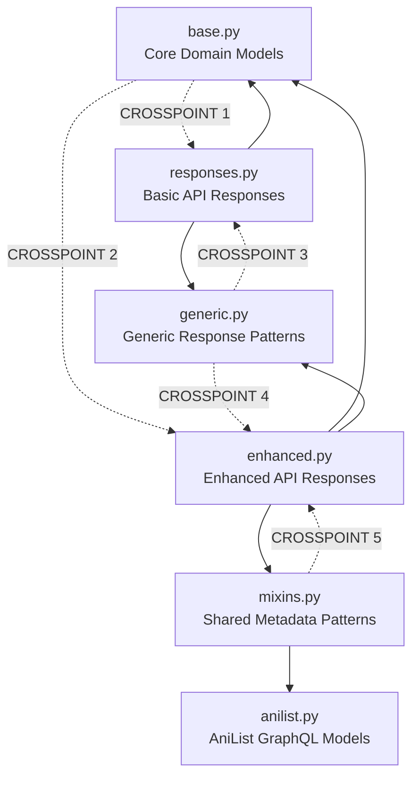

# Model Architecture & Crosspoints

## 🔗 **Dependency Graph & Crosspoints**



## 🎯 **Key Crosspoints Explained**

### **CROSSPOINT 1: base.py ↔ responses.py**
**Location**: `responses.py` wraps `base.py` models for API consumption

```python
# responses.py
from .base import MediaInfo, SearchResult, VideoSource, SeriesDetail

class DetailResponse(BaseModel):
    media: MediaInfo  # ← base.py model wrapped

# Type aliases using base models
PopularResponse = PaginatedResponse[SearchResult]  # ← base.py model
```

**Purpose**: Basic API responses that wrap domain models

---

### **CROSSPOINT 2: base.py ↔ enhanced.py**
**Location**: `enhanced.py` inherits from `base.py` models using composition

```python
# enhanced.py
from .base import MediaInfo, SearchResult, SeriesDetail

class EnhancedSearchResult(SearchResult, AniListMixin):
    pass  # ← Inherits from base.py + adds metadata

class EnhancedMediaInfo(MediaInfo, AniListMixin, EnhancedMetadataMixin):
    pass  # ← Inherits from base.py + adds enhanced metadata
```

**Purpose**: Enhanced models extend base models with AniList metadata

---

### **CROSSPOINT 3: generic.py ↔ responses.py**
**Location**: `responses.py` uses `generic.py` patterns for consistent structure

```python
# responses.py  
from .generic import PaginatedResponse

# Type aliases using generic patterns
PopularResponse = PaginatedResponse[SearchResult]  # ← generic pattern
LatestResponse = PaginatedResponse[SearchResult]   # ← generic pattern
```

**Purpose**: Basic responses use generic pagination patterns

---

### **CROSSPOINT 4: generic.py ↔ enhanced.py**
**Location**: `enhanced.py` uses `generic.py` patterns for enhanced responses

```python
# enhanced.py
from .generic import EnhancedPaginatedResponse, SearchPaginatedResponse

# Type aliases using enhanced generic patterns
EnhancedPopularResponse = EnhancedPaginatedResponse[EnhancedSearchResult]
EnhancedSearchResponse = SearchPaginatedResponse[EnhancedSearchResult]
```

**Purpose**: Enhanced responses use enhanced generic patterns with metadata

---

### **CROSSPOINT 5: mixins.py ↔ enhanced.py**
**Location**: `enhanced.py` composes models using `mixins.py` components

```python
# enhanced.py
from .mixins import AniListMixin, EnhancedMetadataMixin, DetailedMetadataMixin

class EnhancedSearchResult(SearchResult, AniListMixin):
    pass  # ← Uses AniList metadata mixin

class EnhancedSeriesDetail(SeriesDetail, AniListMixin, DetailedMetadataMixin):
    pass  # ← Uses multiple mixins for rich metadata
```

**Purpose**: Enhanced models compose functionality using reusable mixins

---

## 🏗️ **Architectural Layers**

### **Layer 1: Foundation** 
- **`base.py`**: Core domain models (Episode, MediaInfo, SearchResult)
- **`anilist.py`**: External API models (AniList GraphQL schema)

### **Layer 2: Composition Patterns**
- **`mixins.py`**: Reusable metadata components
- **`generic.py`**: Reusable response patterns

### **Layer 3: Implementation**
- **`responses.py`**: Basic API responses (wraps base models)
- **`enhanced.py`**: Enhanced API responses (composes base + mixins)

## 🔄 **Data Flow Through Crosspoints**

```
1. Domain Data (base.py models)
   ↓
2. Generic Patterns (generic.py) + Metadata Mixins (mixins.py)
   ↓
3. API Responses (responses.py OR enhanced.py)
   ↓
4. HTTP JSON Response
```

### **Basic Flow (responses.py):**
```
SearchResult (base.py) 
   → PaginatedResponse[SearchResult] (generic.py)
   → PopularResponse (responses.py)
   → JSON Response
```

### **Enhanced Flow (enhanced.py):**
```
SearchResult (base.py) + AniListMixin (mixins.py)
   → EnhancedSearchResult (enhanced.py)
   → EnhancedPaginatedResponse[EnhancedSearchResult] (generic.py)
   → EnhancedPopularResponse (enhanced.py)
   → JSON Response with metadata
```

## 🎯 **Key Benefits of This Architecture**

### **1. Separation of Concerns**
- **Domain Logic**: `base.py` (pure business models)
- **API Contracts**: `responses.py` (HTTP response wrappers)
- **Enhancement Logic**: `enhanced.py` (metadata-enriched models)
- **Reusable Patterns**: `generic.py` + `mixins.py` (composition components)

### **2. Composition Over Inheritance**
- **Mixins**: Small, focused components that can be combined
- **Generics**: Type-safe patterns that work with any model
- **Multiple Inheritance**: Clean composition without code duplication

### **3. Type Safety & Maintainability**
- **Generic Types**: Compile-time type checking
- **Clear Dependencies**: Easy to understand relationships
- **Single Responsibility**: Each file has one clear purpose

### **4. Scalability**
- **Easy Extension**: New enhanced models can reuse existing mixins
- **Backward Compatibility**: Basic responses remain unchanged
- **Flexible Composition**: Mix and match components as needed

## 📊 **Crosspoint Summary Table**

| Crosspoint | From | To | Purpose | Pattern |
|------------|------|----|---------|---------| 
| **CP1** | `base.py` | `responses.py` | API wrapping | Composition |
| **CP2** | `base.py` | `enhanced.py` | Model extension | Inheritance |
| **CP3** | `generic.py` | `responses.py` | Pattern reuse | Type aliases |
| **CP4** | `generic.py` | `enhanced.py` | Enhanced patterns | Type aliases |
| **CP5** | `mixins.py` | `enhanced.py` | Metadata composition | Multiple inheritance |

This architecture creates a **clean, maintainable, and scalable** model system where each file has a specific role, and crosspoints enable powerful composition patterns! 🚀
